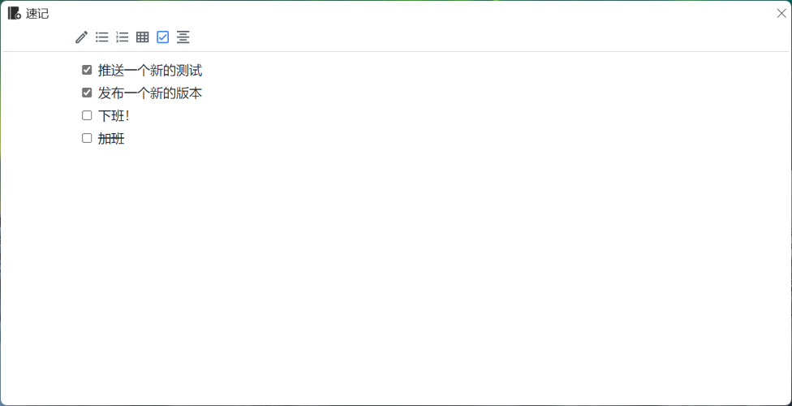
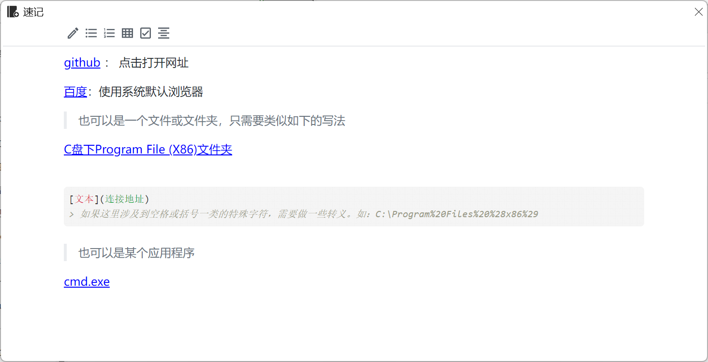

# QuickNodepad

# 环境依赖

# 兼容性

> `Net6`多次更新中存在不兼容性升级，建议直接安装最新版使用，搞不清也可以选独立版本。
>
> 独立版本内置了依赖，体积较大，但可以独立运行

Windows7版本自动下载WebView依赖可能存在SSL问题，自行下载安装即可。

# 说明

使用 `WebView2`内嵌 `vditor`编辑器提供 `markdown`文档的编辑支持

## 注意

软件本身不支持保存功能，仅基于webview提供缓存机制！

## 默认模式

软件首次启动即进入默认模式，显示如下小窗口与任务栏图标，且不做置顶显示。

## 停靠模式

将软件拖拽到屏幕上、右边缘即可激活贴靠模式，此时窗体默认置顶且取消任务栏图标显示。当窗体失去焦点时，自动隐藏到边缘（类似QQ贴边停靠功能）。

将鼠标再次悬浮到屏幕边缘余留的小白条，即可使窗体展开显示。

## 拖放

支持直接将文字、图片拖放到编辑区域内（当处于停靠状态时将自动展开）。

## 记录代办

## 链接

## 更多

关于编辑器的核心功能支持来源于：[vditor](https://github.com/Vanessa219/vditor)